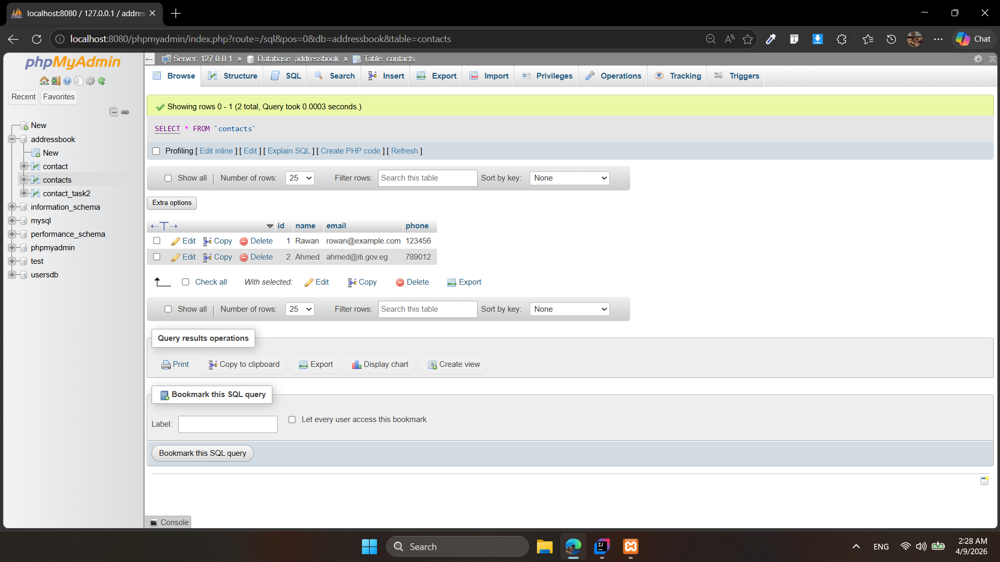
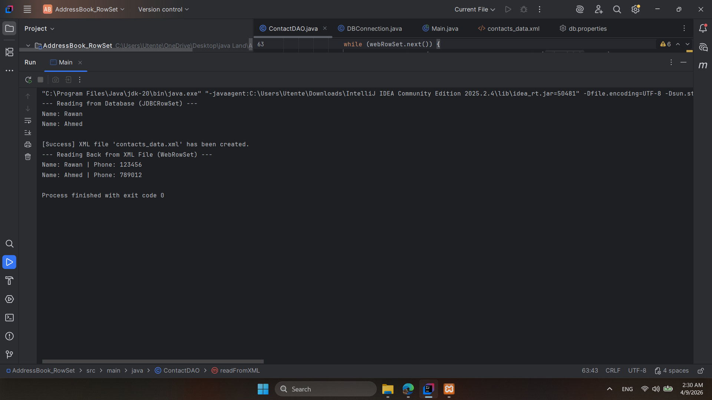
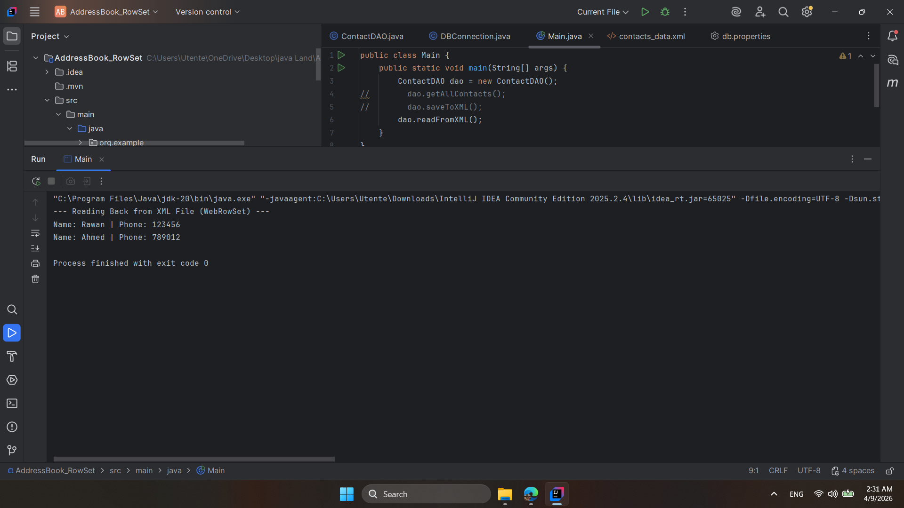

# Address Book (JDBC & WebRowSet)

This project demonstrates using **JDBCRowSet** for database operations and **WebRowSet** for XML serialization, achieving a disconnected data architecture.

## 📸 Project Screenshots

### 1. Database View

### 2. XML Content (Metadata & Data)

### 3. Disconnected Mode (Offline Verification)
